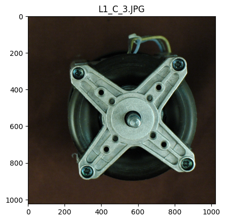
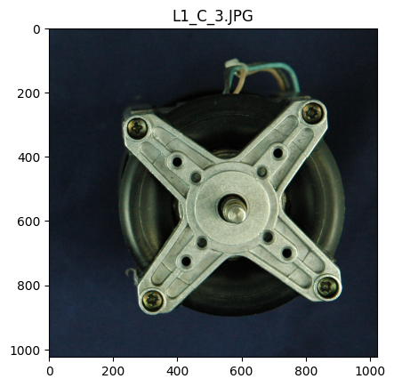
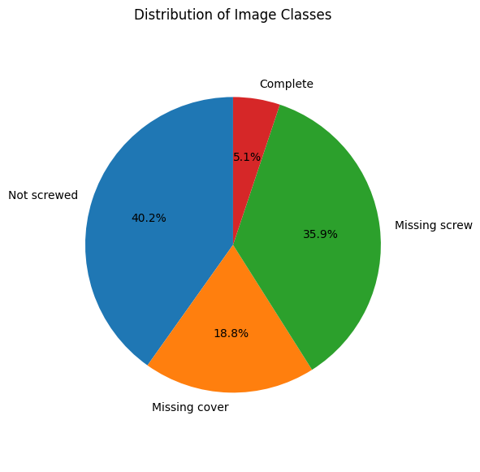
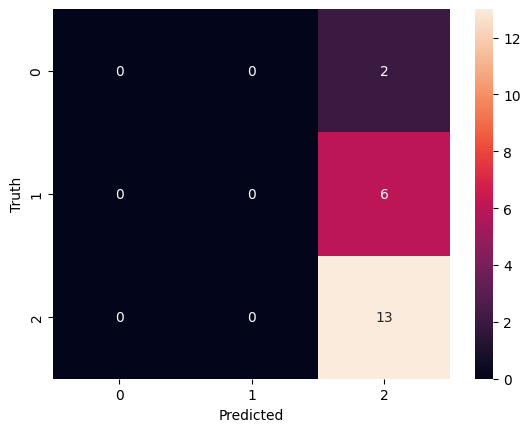
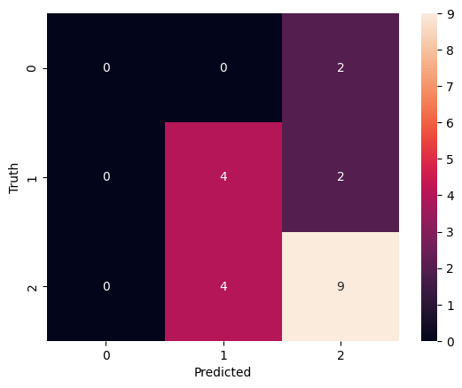
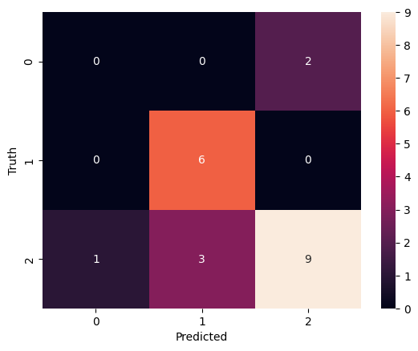

<p align="center">
  
</p>

# Image Processing ML for Electric Motor Production

> Applying machine learning and image processing to **electric motor manufacturing** for defect detection, quality monitoring, and process optimization.

[](#)
[](#)
[](#)

## 📦 Project Structure

```
Image_Processing_ML_Electric_Motor/
├── README.md
├── requirements.txt
├── notebooks/
│   └── Sanobar Workspace.ipynb
├── assets/
│   ├── icon-motor.svg
│   └── plot-XX.png
├── src/
└── data/
```

## 🚀 Quick Start

```bash
git clone https://github.com/SanoTab17/Image_Processing_ML_Electric_Motor.git
cd Image_Processing_ML_Electric_Motor

python -m venv .venv
# Windows
.venv\Scripts\activate
# Linux/Mac
source .venv/bin/activate

pip install -r requirements.txt
jupyter notebook notebooks/Sanobar Workspace.ipynb
```

## 📊 Results














## 🔬 Approach

- Preprocessing of image data (denoising, segmentation, feature extraction)
- ML/CV modeling (CNN, SVM, Random Forest for defect classification)
- Evaluation with accuracy, precision, recall, confusion matrix
- Visualization of results

## 🧠 Research Context

Inspired by IEEE paper: *Machine Learning in Electric Motor Production – Potentials, Challenges and Exemplary Applications*

- Potentials: predictive maintenance, quality prediction, anomaly detection
- Challenges: sensor costs, limited labeled data, need for explainable ML
- Applications: defect detection in casting/welding, winding optimization, EOL testing

## 📝 To Do

- Expand dataset with more annotated samples
- Test transfer learning with pretrained CNNs
- Add explainable AI for interpretability

## 📜 License

MIT — see LICENSE

---
_Last updated: 2025-08-24_
